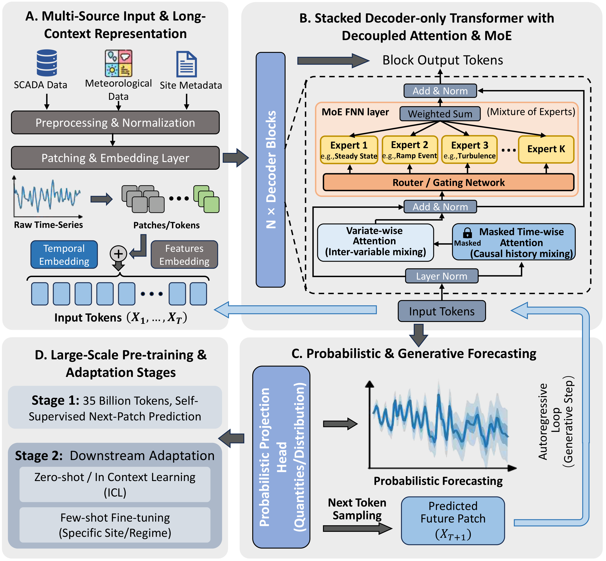

<div align="center">


# DeepWind

### A foundation model for zero-shot wind power forecasting

**Give it a wind site's history — get a calibrated, probabilistic forecast back. No site-specific training.**

[](https://huggingface.co/Hexian-2001/DeepWind1.0-33M)
[](https://huggingface.co/Hexian-2001/DeepWind1.0-890M)
[](https://huggingface.co/Hexian-2001/DeepWind1.0-1.3B)
[](LICENSE)

</div>

---

## What is DeepWind?

DeepWind is a decoder-only Transformer pre-trained on **560 billion wind
observations** drawn from 20 sources (WIND Toolkit + 19 real-world SCADA
collections). It forecasts wind power **zero-shot**: point it at a site it has
*never* seen, feed it a window of history — power, plus whatever weather
covariates you have — and it returns a **21-quantile predictive distribution**
over the next few hours to days.

This repository is the reference implementation for:

> H. Wang et al., "DeepWind: A foundation model for zero-shot wind power
> forecasting," *Energy*, vol. 360, 141793, 2026.
> https://doi.org/10.1016/j.energy.2026.141793

The recipe, in one sentence: **time-aware patching + decoupled time/variate
attention + sparse mixture-of-experts + autoregressive multi-quantile decoding.**

- 🧩 **Time-aware patching** — the series is split into 16-step patches *before*
  it reaches the Transformer, so attention runs over ~512 tokens instead of
  8192 raw steps.
- 🪞 **Decoupled time & variate attention** — one attention axis looks *along*
  time, a second looks *across* variables. Time layers use RoPE, variate layers
  use xPOS.
- 🎛️ **Sparse mixture-of-experts** — every token is routed to the top-2 of a
  handful of experts, so capacity scales without a proportional compute bill.
- 📊 **Direct multi-quantile head** — the model emits 21 quantiles
  (0.01 … 0.99) straight from the final token, giving you intervals and not
  just a single number.

## 🚀 Model zoo

| Model | Params | Zero-shot nCRPS ↓ | Checkpoint |
|---|---|---|---|
| **DeepWind1.0-33M** · small | ~33 M | 0.0921 | [🤗 `Hexian-2001/DeepWind1.0-33M`](https://huggingface.co/Hexian-2001/DeepWind1.0-33M) |
| **DeepWind1.0-890M** · base | ~890 M | 0.0845 | [🤗 `Hexian-2001/DeepWind1.0-890M`](https://huggingface.co/Hexian-2001/DeepWind1.0-890M) |
| **DeepWind1.0-1.3B** · large | ~1.3 B | 0.0834 | [🤗 `Hexian-2001/DeepWind1.0-1.3B`](https://huggingface.co/Hexian-2001/DeepWind1.0-1.3B) |

> nCRPS is the arithmetic mean over the six forecasting horizons (1–12 h),
> each of which is itself the mean across the eight WindBench datasets — the
> paper's zero-shot protocol.

All three sizes share **exactly the same interface** — swap the checkpoint
string and nothing else in your code changes. They differ only in depth, width,
and MoE size:

- **Base (~890M)** is the recommended default. It is the strongest overall,
  taking first place on **21 of the 24** metric×horizon cells in the paper's
  head-to-head against foundation-model baselines.
- **Large (~1.3B)** is the non-monotonic one — it edges ahead of Base at the
  long horizons (8–12 h) but does *not* win across the board, so reach for it
  when long-horizon skill matters and you can afford the extra compute.
- **Small (~33M)** runs happily on a laptop GPU — good for a quick sanity check
  or a few-shot adapter.

## 🏗️ Architecture

<p align="center">
  
</p>

1. **Normalise** — each variable is instance-normalised (arcsinh of a z-score)
   *online*, computed from the context window itself, so you never need to
   pre-scale your data.
2. **Patch** — each normalised variable is cut into 16-step patches, and 9
   per-patch statistics (mean, std, min, max, range, net change, …) are appended
   to every patch as a cheap, robust feature bank.
3. **Embed** — three embeddings are summed into every token:
   - a *time* embedding (relative position),
   - a *variate* embedding (which physical variable this channel is),
   - a *spatial* embedding (latitude/longitude → 3-D Cartesian → MLP).
4. **Encode** — a stack of Transformer blocks alternating time-attention and
   variate-attention, with a top-2 Mixture-of-Experts feed-forward in each.
5. **Decode** — the forecaster expands-and-collapses the context to produce a
   21-quantile forecast for every channel, step by step.

### Variants at a glance

| Setting | Small | Base | Large |
|---|---|---|---|
| hidden size (`d_model`) | 384 | 1024 | 1024 |
| layers | 6 | 12 | 18 |
| attention heads | 6 | 16 | 16 |
| FFN width (`d_ff`, SwiGLU) | 1024 | 2816 | 2816 |
| experts / top-k | 4 / 2 | 8 / 2 | 8 / 2 |
| dropout | 0.05 | 0.05 | 0.10 |
| patch size / stride | 16 / 16 | 16 / 16 | 16 / 16 |
| context window | 8192 | 8192 | 8192 |
| output quantiles | 21 | 21 | 21 |
| **trainable params** | **~33 M** | **~890 M** | **~1.3 B** |

Shared by all variants: RMSNorm, arcsinh normalisation, RoPE + xPOS positional
encoding, coordinate embedding, and a 21-quantile prediction head.

## ⚡ Quick start

### 1. Install

Python 3.10–3.12. Install PyTorch for your platform first (CUDA or ROCm), then:

```bash
pip install git+https://github.com/Hexian-2001/DeepWind.git
```

Or, for a development checkout:

```bash
git clone https://github.com/Hexian-2001/DeepWind.git && cd DeepWind
pip install -e ".[dev]"
```

### 2. Make some (fake) data

DeepWind reads a **2-D `.npy` array of shape `(channels, time)`** plus a small
CSV that says where the site is and which variable each row is. You don't have a
wind farm lying around? Generate one — it takes a few lines of NumPy:

```python
import numpy as np
import pandas as pd

T = 8640                                   # 30 days at 5-min resolution
t = np.arange(T) / 288.0                   # fraction of a day

# channel 0 = power (MW). The rest are weather covariates (see the table below).
wind_speed = np.clip(8 + 4*np.sin(2*np.pi*t) + 1.5*np.cos(2*np.pi*t/3.5)
                     + 0.5*np.random.randn(T), 0, 25)
power = 100.0 * np.clip((wind_speed - 3) / 10.0, 0, 1)      # toy power curve
power = np.clip(power + 2*np.random.randn(T), 0, 100.0)

wind_dir    = (180 + 60*np.sin(2*np.pi*t/2) + 5*np.random.randn(T)) % 360
temperature = 15 + 8*np.sin(2*np.pi*t - 2) + 1.5*np.random.randn(T)
pressure    = 1013 + 5*np.sin(2*np.pi*t/3) + 0.5*np.random.randn(T)
density     = 1.225 * (273.15 / (273.15 + temperature)) * (pressure / 1013)

data = np.stack([power, wind_speed, wind_dir, temperature, pressure, density])
np.save("my_site.npy", data.astype(np.float32))             # (6, T)

pd.DataFrame([{
    "filename":     "my_site.npy",
    "longitude":    -97.5,
    "latitude":     35.2,
    "variate_ids":  "0,1,2,3,4,5",   # which global variable each row is
    "dataset":      "my_site",
}]).to_csv("my_metadata.csv", index=False)
```

### 2b. Load the model and forecast straight from the fake site

Here's the whole forward path — build the input batch exactly the way `infer.py`
does, load the checkpoint, and ask for **any number of future steps** (the
horizon is not hard-coded):

```python
from pathlib import Path
import numpy as np, torch
from omegaconf import OmegaConf
from src.data.datasets import MetadataStore, _pad_and_mask
from src.inference.pipeline import InferencePipeline

# A tiny Hydra config — the pipeline only needs a context length and flags.
cfg = OmegaConf.create({
    "data": {"context_length": 512, "max_vars": 6, "pad_val_id": 10},
    "inference": {"adapter_path": None, "use_amp": False, "inference_quantiles": None},
})

# Build the batch from the .npy + metadata, byte-for-byte like infer.py does.
meta   = MetadataStore("my_metadata.csv").get("my_site.npy")
window = np.load("my_site.npy", mmap_mode="r").astype(np.float32)[:, -512:]
sample = _pad_and_mask(window, meta, 6, 512, 10)
batch  = {k: torch.from_numpy(v).unsqueeze(0) for k, v in sample.items()}

# Load the base checkpoint and forecast 192 steps (= 16 h at 5-min).
pipeline = InferencePipeline(checkpoint_path="Hexian-2001/DeepWind1.0-890M", cfg=cfg)
out = pipeline.predict(batch, pred_len=192)

out.point_preds.shape      # (1, 6, 192)     median forecast, per channel
out.quantile_preds.shape   # (1, 6, 192, 21) all 21 quantiles
power_forecast = out.point_preds[0, 0]       # channel 0 = power
```

Change `pred_len` to `96`, `288`, `12` — whatever your horizon is. The forecaster
decodes it patch-wise (16 steps at a time) and trims to exactly what you asked.

### 3. Forecast

```bash
python infer.py \
  model=deepwind_base \
  inference.checkpoint_path=Hexian-2001/DeepWind1.0-890M \
  data.npy_path=my_site.npy \
  data.metadata_path=my_metadata.csv \
  inference.prediction_length=96 \      # any integer; default 96 (12 h at 5-min)
  data.context_length=8192 \            # default; shrink to 512 for a CPU smoke test
  inference.use_amp=true \
  output.output_path=my_forecast.npz
```

| knob | default | what it does |
|---|---|---|
| `inference.prediction_length` | 96 | forecast horizon in steps — **any integer** |
| `data.context_length` | 8192 | context window in steps (trade speed for context) |
| `inference.use_amp` | true | BF16 autocast on CUDA (no-op on CPU) |
| `inference.mqd_infer` | false | expand-collapse multi-quantile decoding (slower, sharper) |
| `inference.adapter_path` | null | merge a fine-tuned LoRA adapter at load time |
| `output.save_json` | true | also write a human-readable JSON next to the NPZ |

That writes `my_forecast.npz` with:

| key | shape | meaning |
|---|---|---|
| `point_preds` | `(6, 96)` | median forecast per channel |
| `quantile_preds` | `(6, 96, 21)` | all 21 quantiles per channel & step |
| `quantiles` | `(21,)` | the probability levels |
| `context` | `(6, 8192)` | the context window that was used |
| `channel_mask` | `(6,)` | 1 = real channel, 0 = padded |

Channel `0` is power — `quantile_preds[0]` is your power forecast. Read it back:

```python
out = np.load("my_forecast.npz")
p10, p50, p90 = out["quantile_preds"][0, :, [2, 10, 18]]   # power, 10/50/90th
```

> ⚠️ First call downloads the checkpoint from the Hub (~3.5 GB for base). Want a
> quick CPU sanity check? Add `data.context_length=512` to shrink the context.

## 🔮 Zero-shot inference on your own data

The whole game is getting your data into DeepWind's input shape. Here's the
contract.

### Input: one `.npy` per site

- A 2-D array of **`float32`**, shape **`(C, T)`** — `C` channels, `T` time
  steps, row-major by time.
- **Row 0 must be power.** It's the channel the model is scored on; everything
  else is optional context.
- Rows 1–5 are weather covariates, mapped to a fixed global ontology:

| channel | variate id | variable |
|---|---|---|
| 0 | `0` | **power** (normalised to capacity, or raw — see below) |
| 1 | `1` | hub-height wind speed |
| 2 | `2` | wind direction |
| 3 | `3` | temperature |
| 4 | `4` | air pressure |
| 5 | `5` | air density |

- You may have **fewer** than 6 channels. A SCADA turbine that only logs power +
  wind speed is a `(2, T)` array — the loader pads the rest to 6 and masks them
  out. A site with power only is a `(1, T)` array.
- The model reads the last `context_length` steps as context and generates the
  next `prediction_length` steps. **Neither is hard-coded**: `prediction_length`
  can be any integer (see the quick start), and `context_length` defaults to
  8192 but can be shortened to trade context for speed.

### Input: one `metadata.csv`

Columns, in order of importance:

| column | required? | meaning |
|---|---|---|
| `filename` | ✅ | the `.npy` filename, exactly as on disk |
| `variate_ids` | 👍 recommended | comma-separated global ids, e.g. `"0,1,2"`, one per channel (in row order) |
| `longitude`, `latitude` | optional | site coordinates in degrees |
| `dataset` | optional | free-form tag (used for balanced pre-training sampling) |

**With coordinates** — DeepWind converts lat/lon to a 3-D Cartesian vector and
adds a learned spatial embedding, so the model "knows" where the site is.

**Without coordinates** — just leave `longitude`/`latitude` empty. DeepWind
falls back to a shared learned embedding for "unknown site". Zero-shot still
works; it's just one less signal.

**Missing `variate_ids`** — if you don't tell it which variable each row is, the
loader fills every slot with the padding id, and the model treats all channels
as unlabelled. Fine in a pinch, but **providing `variate_ids` is the single
biggest accuracy lever** for zero-shot — it's how the model knows "row 1 is wind
speed, not temperature."

> 💡 **Normalisation is free.** DeepWind applies arcsinh + instance normalisation
> *inside* the model, computed from the context window. Feed raw values; don't
> pre-scale.

## 🎯 Fine-tuning

When you *do* have target-site data, a few epochs of LoRA adapt DeepWind to it.
The recipe keeps the base frozen except for a low-rank update on the
**variate-attention QKV/output projections** (`r=16`, `α=32`), while the MoE
**router** and the **prediction head** fine-tune in full — parameter-efficient
and cheap.

```bash
python finetune.py \
  model=deepwind_base \
  finetune.pretrained_path=Hexian-2001/DeepWind1.0-890M \
  data.npy_path=/path/to/site.npy \
  data.metadata_path=/path/to/metadata.csv \
  run_name=my-site
```

| knob | default | what it does |
|---|---|---|
| `finetune.lora_r` / `finetune.lora_alpha` | 16 / 32 | LoRA rank & scale |
| `training.num_train_epochs` | 30 | epochs over the site's windows |
| `training.per_device_train_batch_size` | 64 | batch size |
| `data.stride` | 16 | step between context windows |
| `data.finetune_rate` | 1.0 | keep a fraction of windows (few-shot) |

**What actually trains:** the low-rank adapters on the variate-attention
projections, plus the MoE router and the quantile head. Everything else stays
frozen, so the adapter is a few MB and gradients are cheap. This is the same
few-shot strategy the paper uses to cold-start newly commissioned farms.

**Compute:** modest — because most of the model is frozen, a single site
typically fine-tunes in well under an hour on one modern GPU. The exact time
scales with the number of windows (`stride` × `finetune_rate` × epochs), so
drop `finetune_rate` or `num_train_epochs` for a quicker sweep.

The result is a LoRA adapter directory. Use it at inference by adding
`inference.adapter_path=/path/to/adapter` — the pipeline merges it into the
base weights and unloads the scaffolding, so the serving path is identical.

## 🏋️ Pretraining

To train your own DeepWind from scratch, point the data config at a corpus of
`.npy` files and a metadata CSV:

```text
$DEEPWIND_DATA_ROOT/
├── train/               # one (channels, time) .npy per series
├── eval/                # held-out series
├── train_metadata.csv
└── eval_metadata.csv
```

```bash
export DEEPWIND_DATA_ROOT=/path/to/deepwind-data
export DEEPWIND_RUNS_ROOT=/path/to/deepwind-runs

python train.py \
  model=deepwind_base \
  training=deepwind_base \
  run_name=my-run
```

Model variants live in `configs/model/` (`deepwind_small`, `deepwind_base`,
`deepwind_large`); training schedules in `configs/training/`. The paper
protocol — global batch 256, 100,000 steps, peak LR `1e-4`, 3,000-step linear
warmup, cosine decay, BF16, gradient clip 1.0, AdamW (β₁=0.9, β₂=0.95, weight
decay 0.01) — is encoded in those files and needs no flags.

Corpus design matters more than the model: DeepWind was trained with **0.7
synthetic (WIND Toolkit) / 0.3 real (SCADA)** sampling weights, and each site's
channels are labelled with `variate_ids` so the variate embedding can transfer
across sources. See `configs/data/train.yaml` for the knobs (balanced sampling,
adaptive windowing, and the Phase-1 sim-to-real augmentation).

### What full reproduction costs

Measured from the real training runs (16× AMD Instinct MI250X — 2 nodes × 8
GPUs — BF16, global batch 256, 100k steps). Wall time is the *actual* wall-clock
rate including periodic eval and checkpoint writes, so it is slower than the
paper's short-benchmark extrapolation.

| Variant | Params | Measured rate | Wall time (100k steps) | GPU-hours |
|---|---|---|---|---|
| Small | ~33 M | ~1.7 steps/s | ~16 h | ~260 |
| Base | ~890 M | ~0.2 steps/s | ~134 h | ~2,140 |
| Large | ~1.3 B | ~0.14 steps/s | ~196 h | ~3,140 |

> Sources: **Small** — today's `deepwind-small-loss-powonly` run
> (checkpoint→checkpoint on 16 MI250X). **Base** — the Sep-18
> `deepwind-base-paper-seed42` run (real wall-clock, before the
> `ddp_find_unused_parameters=false` fix, so expect it to improve on re-run).
> GPU-hours = wall time × 16.

So a Small reproduction is a single overnight run on a 16-GPU node; Base and
Large are multi-day jobs. On fewer GPUs the wall time scales up roughly linearly
(keep the effective batch at 256 via gradient accumulation). The corpus itself —
560 billion observations across 20 sources — is the expensive part to assemble;
the Shanxi Wind SCADA source is proprietary and not redistributed, which is why
only WIND Toolkit is shipped for re-training.

On Pawsey Setonix, the job templates under `scripts/setonix/` are
account-portable — they resolve run/data/venv/project roots from `$MYSCRATCH`
and `$MYSOFTWARE` (overridable with the `DEEPWIND_*` variables). Set your Slurm
account and create `slurm-logs/` before a direct `sbatch`.

## 📊 Results

Zero-shot evaluation on **WindBench** (8 datasets × 6 horizons), as reported in
the paper. Each cell is the arithmetic mean across the eight datasets; lower is
better for nCRPS and nMAE.

**nCRPS ↓** (probabilistic):

| Horizon | Small | Base | Large |
|---|---|---|---|
| 1 h | 0.0425 | 0.0402 | 0.0400 |
| 2 h | 0.0648 | 0.0625 | 0.0638 |
| 4 h | 0.0925 | 0.0890 | 0.0920 |
| 6 h | 0.1075 | 0.0950 | 0.1013 |
| 8 h | 0.1175 | 0.1072 | 0.1004 |
| 12 h | 0.1275 | 0.1130 | 0.1030 |
| **mean** | **0.0921** | **0.0845** | **0.0834** |

**nMAE ↓** (point):

| Horizon | Small | Base | Large |
|---|---|---|---|
| 1 h | 0.0579 | 0.0543 | 0.0563 |
| 2 h | 0.0804 | 0.0744 | 0.0784 |
| 4 h | 0.1107 | 0.0990 | 0.1055 |
| 6 h | 0.1319 | 0.1140 | 0.1223 |
| 8 h | 0.1478 | 0.1267 | 0.1360 |
| 12 h | 0.1741 | 0.1438 | 0.1572 |
| **mean** | **0.1171** | **0.1020** | **0.1093** |

Two takeaways from the paper:

1. **DeepWind-Base beats every foundation-model baseline** (Chronos-2,
   TimesFM-2.5, TiRex, Moirai-2) at every horizon, and — zero-shot — still
   outperforms full-shot supervised baselines (DeepAR, LGBM, PatchTST, …) on the
   same benchmark.
2. **Scaling is non-monotonic.** Large doesn't strictly dominate Base: it wins
   at 8–12 h but loses at shorter horizons, which is why Base is the recommended
   default and Large is the long-horizon specialist.

## 📁 Repository layout

```text
configs/        Hydra model, data, training, and inference configurations
src/            Model, datasets, training, inference, and evaluation
scripts/        Local and Pawsey/Setonix launch templates
test/           Unit and integration tests
model_cards/    Per-checkpoint model cards (also published on the Hub)
```

Large datasets, checkpoints, logs, and experiment outputs are deliberately not
stored in Git.

## 📜 License & citation

Code is Apache-2.0; model weights are Apache-2.0. Dataset licenses are handled
separately — the proprietary Shanxi Wind source is not redistributed. If this
helps your work, cite:

```bibtex
@article{wang2026deepwind,
  title     = {DeepWind: A foundation model for zero-shot wind power forecasting},
  author    = {Wang, Hexian and Zhou, Tongming and Jia, Chengzhen and Liu, Yushan and Wang, Lingmei},
  journal   = {Energy},
  volume    = {360},
  pages     = {141793},
  year      = {2026},
  doi       = {10.1016/j.energy.2026.141793}
}
```
